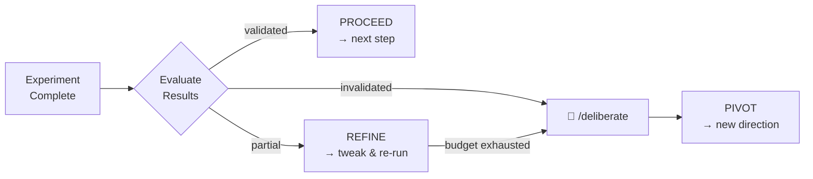
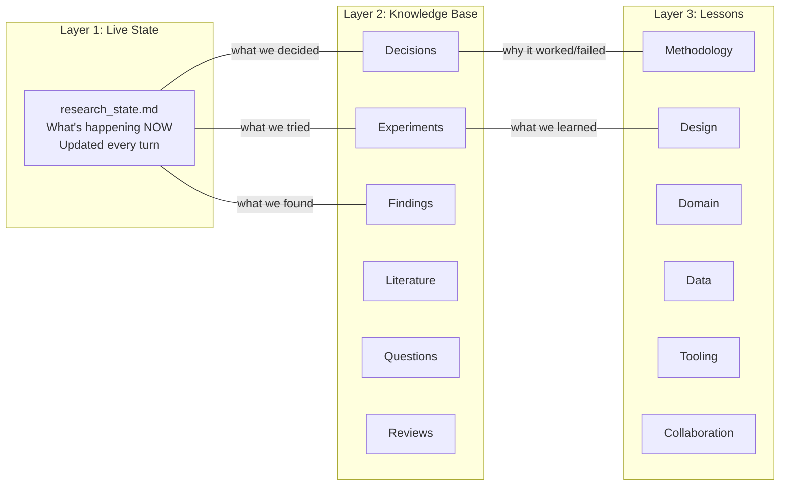
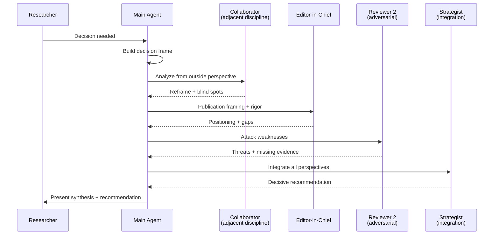
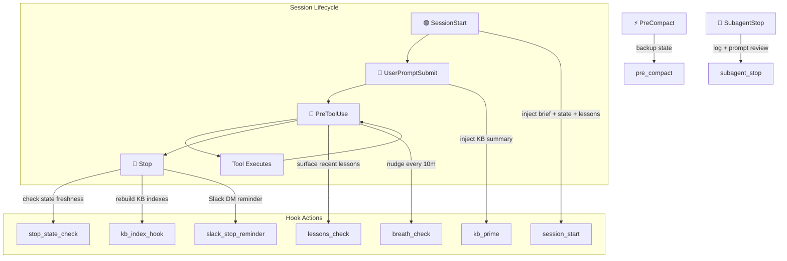
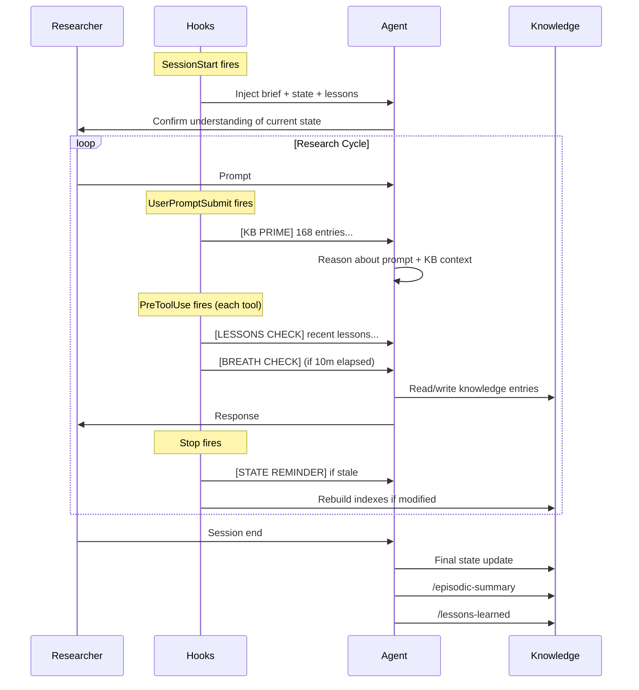

# Research Collaborator

A Claude Code framework for rigorous, long-running research projects. It turns Claude into a virtual research collaborator that maintains persistent knowledge, enforces research protocols, and self-corrects during execution.

Built for researchers who use Claude Code as a daily tool for experimental design, data analysis, and manuscript preparation.

## What It Does

- **Enforces research protocols** via hooks (mechanical guarantees, not just prompt instructions)
- **Maintains three persistent knowledge systems** across sessions: operational state, categorized knowledge base, and lessons learned with self-reflection
- **Tracks research progression** with a curated Roadmap of inflection points (PROCEED/REFINE/PIVOT decisions), designed for paper-writing
- **Manages a project backlog** with auto-capture of ideas as tickets, effort tracking, and auto-close when decisions resolve questions
- **Supports multi-perspective deliberation** with 4 simulated reviewer personas
- **Plans complex tasks with adversarial review** — a Plan subagent drafts, a Review subagent critiques, the main agent synthesizes
- **Manages concurrent research streams** via sub-projects with isolated state
- **Self-checks during long executions** via time-gated health monitoring
- **Bootstraps new projects** with a single command

## Architecture

```mermaid
graph TB
    subgraph "Claude Code Session"
        Agent["Main Agent<br/>(Opus)"]
    end

    subgraph "Hooks (Mechanical Guarantees)"
        H1["session_start<br/>SessionStart"]
        H2["lessons_check<br/>PreToolUse"]
        H3["breath_check<br/>PreToolUse ⏱️"]
        H4["kb_prime<br/>UserPromptSubmit"]
        H5["stop_state_check<br/>Stop"]
        H6["kb_index_hook<br/>Stop"]
        H7["pre_compact<br/>PreCompact"]
        H8["subagent_stop<br/>SubagentStop"]
        H9["slack_stop_reminder<br/>Stop"]
        H10["post_tool_use_buffer<br/>PostToolUse ⏱️"]
    end

    subgraph "Skills (On-Demand)"
        S1["/research-collaborator"]
        S2["/deliberate"]
        S3["/knowledge-base"]
        S4["/lessons-learned"]
        S5["/episodic-summary"]
        S6["/research-decision"]
        S7["/data-loader"]
        S8["/sub-project"]
        S9["/slack"]
        S10["/propose-lessons"]
        S11["/adopt-to-sub-project"]
        S12["/pm"]
        S13["/note-taker"]
        S14["/house-keeping"]
        S15["/review-figure"]
    end

    subgraph "Subagents (Delegated Work)"
        A1["literature-researcher"]
        A2["code-implementer"]
        A3["data-analyst"]
        A4["figure-specialist"]
        A5["deliberate personas<br/>(4 reviewers)"]
        A6["note-taker-classifier<br/>(Haiku)"]
        A7["subproject-capture<br/>(Haiku)"]
    end

    subgraph "Persistent State"
        RS["research_state.md<br/>(Roadmap + Task Queue)"]
        KB["knowledge/<br/>(categorized KB)"]
        LL["lessons/<br/>(self-reflection)"]
        PM[".pm_backlog.md<br/>(ticket backlog)"]
        EP["episodes/<br/>(session narratives)"]
    end

    H1 -->|inject context| Agent
    H2 -->|surface lessons| Agent
    H3 -->|nudge every 10m| Agent
    H4 -->|KB summary| Agent
    Agent -->|invoke| S1 & S2 & S3 & S4 & S5 & S6
    Agent -->|delegate| A1 & A2 & A3
    S2 -->|spawn| A4
    Agent -->|read/write| RS & KB & LL & EP
    H5 -->|check freshness| RS
    H6 -->|maintain indexes| KB
```



## Quick Start

### 1. Bootstrap a New Project

```bash
cd research-collaborator
./init_project.sh my_study "My Research Title"
cd ../my_study
claude
```

This creates a sibling directory with all symlinks, scaffolding, templates, and hook wiring ready to go.

### 2. First Session

The `session_start` hook fires automatically and checks for:
- `project_brief.md` — fill this in with your research details
- `research_state.md` — created by the init script; the agent confirms its understanding

### 3. Start Working

The framework follows the **Plan-Review-Execute** protocol:
1. Tell the agent what you want to do
2. It proposes a plan
3. You review and approve (or revise)
4. It executes only after approval

Use **"noted"** to provide multiple inputs before the agent engages (Async Input Protocol).

## Core Protocols

### Async Input Protocol

When providing ideas or context in bulk:
- Agent responds only with **"noted"** for each input
- Say **"I am done."** to trigger full engagement

### Plan-Review-Execute

Every task follows: **PLAN** → **CLARIFY** → **REVIEW** → **APPROVE** → **EXECUTE**. The agent never skips from plan to execution without your explicit approval.

Before proposing any plan, the agent reads the lessons index and incorporates relevant past lessons (referenced by ID). For **complex tasks**, a Plan subagent drafts the plan, an Adversarial Review subagent critiques it, and the main agent synthesizes both into the final proposal. For simple tasks, the agent plans directly.

### Research Decision Protocol

After every experiment or milestone, the agent evaluates:
- **PROCEED** — results validate the approach
- **REFINE** — partially promising; tweak and re-run
- **PIVOT** — core assumptions invalidated; propose alternatives

Decisions update the **Roadmap** in the state document (one row per inflection point) and auto-close any resolved PM tickets.



## Knowledge Systems

The framework maintains three persistent layers that accumulate across sessions:



### research_state.md (Layer 1)

The primary anti-drift mechanism. Updated after every substantive exchange.

| Section | Purpose |
|---------|---------|
| Active Phase | Current task and status |
| Roadmap | Program Timeline (inflection points) + Sub-Project Status — designed for paper-writing |
| Task Queue | Compact index of active PM tickets, synced from `.pm_backlog.md` |
| Decisions Made | Append-only decision log with rationale |
| Open Questions | Tracked questions (open / parked / resolved) |
| Settled Assumptions | Not re-questioned unless explicitly reopened |
| Scope Boundaries | In scope / out of scope / deferred |
| Key Artifacts | Important files and their status |

The `stop_state_check` hook warns if the state doc wasn't updated after a substantive turn.

### knowledge/ (Layer 2)

Structured, categorized knowledge base with 6 categories:

| Category | ID Format | Contents |
|----------|-----------|----------|
| Decisions | `D1`, `D2`, ... | Design choices with rationale |
| Experiments | `EXP-001`, ... | Run configs, results, analysis |
| Findings | `F-001`, ... | Validated insights with evidence |
| Literature | Author (Year) | Papers, claims, relevance |
| Questions | `Q-001`, ... | Research questions (open/parked/resolved) |
| Reviews | `R-001`, ... | Feedback, critiques, audits |

Each category has three tiers: `*_active.md` (current), `*_archive.md` (superseded/resolved), `*_index.md` (auto-generated lookup table).

The `kb_index_hook` automatically maintains indexes and archives marked entries on session stop.

### lessons/ (Layer 3)

Lessons learned with self-reflection — captures WHY decisions led to outcomes, not just what happened.

**Self-Reflection Protocol** (applied before writing each lesson):
1. What did we decide/do?
2. What was the reasoning at the time?
3. What did we expect?
4. What actually happened?
5. Where was the gap?
6. What was the root cause?
7. Does this generalize?

Lessons have **recency decay**: fresh (0-14 days) are always surfaced, recent (15-30 days) on category match, aging (31-60 days) on strong match, archived (60+ days) only on explicit search.

## Skills Reference

Skills are on-demand capabilities invoked via slash commands. They load only when needed (progressive disclosure).

### /research-collaborator

Full behavioral norms, audience modes, communication style, and the `research_state.md` template. Activate when brainstorming, planning experiments, reviewing literature, or writing for publication.

### /deliberate

Multi-perspective deliberation for high-stakes decisions. Spawns 4 simulated personas who analyze the decision sequentially:



**When to use**: PIVOT decisions, assumption invalidation, paper framing, irreversible choices (venue selection, methodology commitment).

**Budget presets**: `full` (4 personas), `quick` (1 persona), `deep` (4 + extended).

### /knowledge-base

Record and retrieve structured KB entries. Handles ID generation, cross-referencing, and category routing.

```
/knowledge-base record decision "Use Gemma 4 E4B as backbone"
/knowledge-base retrieve decisions --status active
/knowledge-base search "confidence threshold"
```

### /lessons-learned

Extract generalizable lessons through self-reflection. Use at session end, after REFINE/PIVOT, or when experiments produce unexpected results.

### /episodic-summary

Generate a narrative summary of a conversation episode — what was discussed, decided, changed, and what remains open. Useful for session wrap-ups and onboarding new sessions.

### /research-decision

Structured PROCEED / REFINE / PIVOT evaluation after experiments or milestones. Includes automatic artifact versioning for rollback safety.

### /data-loader

Load datasets from HuggingFace Hub or Kaggle. Handles authentication, format detection, validation, storage, and basic profiling.

### /sub-project

Manage concurrent research streams within a project. Each sub-project gets isolated knowledge, lessons, episodes, and state.

```
/sub-project create dark-side "Failure Modes Paper"
/sub-project switch dark-side
/sub-project capture icl-pilot "Try few-shot with 5 Normal examples"
/sub-project status
```

See [SPEC.md v1.1](.claude/skills/sub-project/SPEC.md) for the directory layout invariants. The canonical empty sub-project structure lives at `sub_project_template/` at the framework root — both `/sub-project create` and the sibling `/adopt-to-sub-project` skill consume it as one source of truth.

### /adopt-to-sub-project

Sibling skill to `/sub-project` for **one-time retroactive migration** of existing root-level material into a new sub-project. Use once per sub-project when you need to formalize an existing research stream that was started at the project root.

```
/adopt-to-sub-project pilot "HICSS Dark Side Paper" "Failure modes taxonomy"
# Classifier agent scans root, writes .adopt_proposal.md
# Researcher reviews checkboxes in the proposal
/adopt-to-sub-project pilot --execute
# Physical moves with backup, path-fixup detection, log-driven rollback
/adopt-to-sub-project pilot --rollback
# Reverses every move and fixup using backup copies
```

Runs in three phases: **propose** (non-destructive, dispatches a Haiku classifier to write `subprojects/<slug>/.adopt_proposal.md`), **review** (researcher toggles `[x]`/`[ ]` checkboxes), **execute** (physical moves + in-place path fixups + backup + log + state updates). Every operation is logged to `ADOPTION_LOG.md` and every file/fixup is backed up to `.sub_project_adopt_backup/<slug>_<ts>/` — nothing is destroyed without a copy existing elsewhere.

**Hard-refuse list** — paths the skill will not move even if the proposal checks them: `research_state.md`, `project_brief.md`, `CLAUDE.md`, `.claude/`, `.venv/`, `subprojects/`, `.sub_project_adopt_backup/`.

**Separation from `/sub-project`**: intentional. Daily management (`create`, `capture`, `switch`, `list`, `status`) has a very different risk profile from a one-time destructive migration. Separating them isolates adoption bugs from stable daily-use commands.

### /propose-lessons

Invoked automatically when the `post_tool_use_buffer` hook emits a `[LESSON EXTRACT]` trigger. Dispatches a background subagent that scans the tool-activity buffer at `.tool_use_buffer.jsonl`, compares against the existing lessons index, and writes candidate lesson drafts to `.proposed_lessons.md` for researcher review. The main agent reviews the candidates and then invokes `/lessons-learned` for any worth promoting — the `/lessons-learned` skill remains the single writer to the permanent lessons KB.

### /pm

Lightweight project manager. Tickets are KB-QST entries tracked by `.pm_backlog.md`. Commands: `list`, `scan`, `add`, `pick`, `close`, `timetable`, `prioritize`, `next` (read-only), `status` (read-only). Ideas captured during "noted" sessions auto-register as tickets. When `/research-decision` resolves a question that's a ticket, it auto-closes. The agent surfaces open ticket counts before each prompt and asks prioritize-or-queue when you start a new task.

### /note-taker

Inspect and triage ideas auto-captured during "noted" sessions. The `note-taker-classifier` (Haiku subagent) runs in the background after each "noted" acknowledgment, classifying ideas into KB categories or staging uncertain items for review. Commands: `status`, `review`.

### /house-keeping

KB hygiene: scans active findings and decisions for validation status, proposes converting unvalidated entries to open questions. Follows the propose-review-execute pattern — non-destructive scan, researcher reviews, then executes approved changes. Automatically suggested after episodic summaries.

### /review-figure

Two-pass review of manuscript figures. Pass 1: style compliance against `FIGURE_AGENT_PROMPT.md` (sections 1-11). Pass 2: factual grounding against KB, config, source code. Never modifies files — report only.

### /slack

Async communication with the researcher via Slack DM. Use when input is needed during unattended execution or when a task completes.

## Hooks Reference

Hooks provide mechanical guarantees — they enforce behaviors that prompt instructions alone cannot reliably maintain over long contexts.



| Hook | Event | Purpose | Fires |
|------|-------|---------|-------|
| `session_start.sh` | SessionStart | Inject project brief, state, recent lessons, active sub-project, open PM ticket count | Once per session |
| `kb_prime.sh` | UserPromptSubmit | Inject KB entry counts, index paths, pending proposed-lessons, PM ticket counts | Every prompt (>30 chars) |
| `lessons_check.sh` | PreToolUse | Surface fresh/recent lessons before actions | Every Task/Write/Edit/Bash |
| `breath_check.sh` | PreToolUse | Plan compliance, task health, intermediate findings | Every 10 min (configurable) |
| `post_tool_use_buffer.sh` | PostToolUse | Buffer tool activity + emit debounced `[LESSON EXTRACT]` trigger | Every tool call (cheap, no LLM) |
| `stop_state_check.sh` | Stop | Warn if `research_state.md` not updated | Every agent response |
| `kb_index_hook.sh` | Stop | Regenerate KB indexes, auto-archive marked entries | When KB files modified |
| `pre_compact.sh` | PreCompact | Backup state doc before context compaction | Before compaction |
| `subagent_stop.sh` | SubagentStop | Log subagent completion, prompt artifact review | When subagent finishes |
| `slack_stop_reminder.sh` | Stop | Remind to close Slack session | When Slack session active |

### breath_check Configuration

The `breath_check` hook is time-gated: it fires only when >=10 minutes have elapsed since the last check. Override the interval:

```bash
export BREATH_CHECK_INTERVAL=300  # 5 minutes
```

**Convention**: Tasks expected to take >10 minutes should use `run_in_background` so the hook can fire between polling calls.

### post_tool_use_buffer Configuration

The `post_tool_use_buffer` hook is cheap (~25 ms/fire, no LLM) and runs on every tool call. It appends a compact JSONL record to `.tool_use_buffer.jsonl`, skips noisy tools by default, and emits a `[LESSON EXTRACT]` trigger when both a time gate and an event-count gate pass. Override the thresholds:

```bash
export LESSON_EXTRACT_INTERVAL_SEC=900   # default 15 min between triggers
export LESSON_EXTRACT_MIN_EVENTS=15      # default min buffer events to trigger
export LESSON_EXTRACT_MIN_ERRORS=1       # default min errors to trigger early
export LESSON_BUFFER_SKIP_TOOLS="Read,Glob,TodoWrite,TaskList,TaskGet"
export LESSON_BUFFER_MAX_BYTES=2097152   # default 2 MB rotation threshold
```

When the trigger fires, the main agent invokes `/propose-lessons` which dispatches a background subagent to draft candidate lessons. The researcher reviews them in `.proposed_lessons.md` before promoting any to the permanent lessons KB via `/lessons-learned`.

## Subagents Reference

Subagents handle delegated work in isolated contexts, protecting the main conversation window.

| Agent | Model | Purpose | Delegated By |
|-------|-------|---------|-------------|
| `literature-researcher` | Sonnet | Search and summarize academic papers | Main agent |
| `code-implementer` | Sonnet | Write and test code | Main agent |
| `data-analyst` | Sonnet | Run analysis, generate visualizations | Main agent |
| `figure-specialist` | Sonnet | Create publication-quality figures (matplotlib/graphviz) | Main agent |
| `deliberate-collaborator` | Sonnet | Adjacent discipline perspective | /deliberate |
| `deliberate-editor` | Sonnet | Editor-in-Chief (publication framing) | /deliberate |
| `deliberate-reviewer2` | Sonnet | Adversarial peer reviewer | /deliberate |
| `deliberate-strategist` | Sonnet | Integration and decisive recommendation | /deliberate |
| `deliberate-evidence-retriever` | Haiku | Select top-5 KB entries per persona, synthesize evidence brief | /deliberate |
| `deliberate-context-distiller` | Haiku | Build compact evidence indexes (< 700 words) | /deliberate |
| `note-taker-classifier` | Haiku | Classify async input → KB entries or staged items; auto-register tickets | "noted" protocol |
| `subproject-capture` | Haiku | Record ideas for inactive sub-projects | /sub-project |
| `subproject-adopt-classifier` | Haiku | Classify root material for sub-project adoption | /adopt-to-sub-project |

**Delegation rules**: The main agent may delegate literature search, code, analysis, figure creation, and plan drafting (with adversarial review). It **never** delegates design decisions, protocol enforcement, state management, researcher interaction, plan synthesis, or plan approval.

## Project Structure

After running `init_project.sh`, your project looks like:

```
my_study/
├── CLAUDE.md                    # @../research-collaborator/CLAUDE.md
├── project_brief.md             # Your research scope (fill this in)
├── research_state.md            # Live operational state
├── .gitignore
│
├── .claude/
│   ├── hooks → ../../research-collaborator/.claude/hooks   (symlink)
│   ├── settings.json            # Hooks wiring + permissions
│   ├── settings.local.json      # Your permissions (create manually)
│   ├── skills/
│   │   ├── research-collaborator → (symlink)
│   │   ├── knowledge-base → (symlink)
│   │   ├── lessons-learned → (symlink)
│   │   ├── episodic-summary → (symlink)
│   │   ├── research-decision → (symlink)
│   │   ├── data-loader → (symlink)
│   │   ├── slack → (symlink)
│   │   ├── pm → (symlink)
│   │   ├── note-taker → (symlink)
│   │   ├── propose-lessons → (symlink)
│   │   ├── house-keeping → (symlink)
│   │   ├── adopt-to-sub-project → (symlink)
│   │   ├── review-figure → (symlink)
│   │   ├── deliberate/          # Copied (customize personas)
│   │   └── sub-project/         # Copied
│   └── agents/
│       ├── code-implementer.md → (symlink)
│       ├── data-analyst.md → (symlink)
│       ├── literature-researcher.md → (symlink)
│       ├── deliberate-*.md      # Copied (customize for your domain)
│       └── subproject-capture.md # Copied
│
├── knowledge/                   # Categorized knowledge base
│   ├── decisions_active.md
│   ├── experiments_active.md
│   ├── findings_active.md
│   ├── literature_active.md
│   ├── questions_active.md
│   └── reviews_active.md
│
├── lessons/                     # Lessons with self-reflection
│   ├── lessons_index.md
│   ├── methodology.md
│   ├── design.md
│   ├── domain.md
│   ├── data.md
│   ├── tooling.md
│   └── collaboration.md
│
├── episodes/                    # Session narratives
├── versions/                    # Artifact snapshots
├── deliberations/               # /deliberate working files
├── subprojects/                 # Concurrent research streams
├── data/                        # Datasets
├── memory/                      # Project memory snapshots
└── .state_backups/              # Pre-compaction backups
```

**Symlinked** components stay in sync with the framework. **Copied** components (deliberate skill, persona agents) are yours to customize for your domain.

## Customization

### Deliberate Personas

The 4 deliberate personas in `.claude/agents/deliberate-*.md` should be tuned for your research domain. Edit these to specify:
- What adjacent discipline the Collaborator represents
- What venue framing the Editor-in-Chief targets
- What methodological weaknesses Reviewer 2 attacks
- What strategic considerations the Strategist weighs

### Permissions

Create `.claude/settings.local.json` with project-specific permissions:

```json
{
  "permissions": {
    "allow": [
      "Bash(uv run:*)",
      "Skill(knowledge-base)",
      "Skill(episodic-summary)",
      "Skill(research-decision)"
    ]
  }
}
```

### breath_check Interval

Set `BREATH_CHECK_INTERVAL` environment variable (in seconds, default 600):

```bash
export BREATH_CHECK_INTERVAL=300  # check every 5 minutes
```

## Session Lifecycle



## Documentation

| Document | Audience | Content |
|----------|----------|---------|
| [One-Pager](docs/one-pager.md) | Collaborators new to the framework | Plain-language overview of what it does and how it works |
| [Architecture Reference](docs/architecture.md) | Developers and power users | Full technical reference: all layers, skills, agents, hooks, knowledge architecture |
| [Getting Started](docs/getting_started/) | New users setting up | Step-by-step guides from installation to first session |

## Requirements

- [Claude Code](https://claude.ai/code) CLI or desktop app
- `jq` (used by hooks to parse JSON stdin)
- `bash` 3.2+ (macOS default is sufficient)
- Python 3.10+ with `uv` (for `kb_maintain.py` and data analysis)
