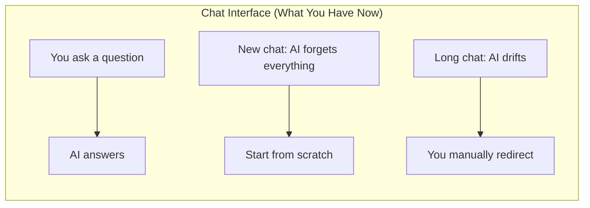
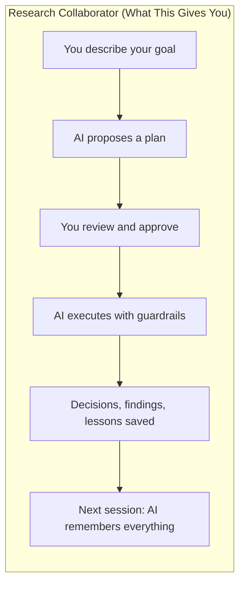

# Why This Exists

## The Problem with Chat-Based AI for Research

If you've used ChatGPT or Claude on the web, you know the pattern: you ask a question, get an answer, and move on. It works great for one-off tasks — summarizing a paper, brainstorming ideas, debugging code.

But research isn't a series of one-off tasks. It's a months-long process where decisions build on each other, experiments inform next steps, and context matters enormously. Chat interfaces have three fundamental problems for this:

1. **They forget everything.** Start a new conversation and your AI has no idea what you decided last week, what experiments you've run, or why you chose your current methodology.

2. **They drift.** In a long conversation, the AI gradually loses track of your plan. It starts suggesting things you've already tried, contradicts earlier decisions, or goes off on tangents.

3. **They can't self-correct.** If the AI makes a mistake or drifts from your plan, there's no mechanism to catch it. You have to notice and manually redirect — every time.

## What If Your AI Remembered Everything?

The Research Collaborator framework turns Claude into something closer to an actual research partner:

### What changes:

| | Chat Interface | Research Collaborator |
|---|---|---|
| **Memory** | Forgets between sessions | Persistent knowledge base (decisions, findings, literature) |
| **Planning** | Answers immediately | Proposes a plan, waits for your approval |
| **Self-correction** | You catch every mistake | Automatic health checks during long tasks |
| **Knowledge** | You re-explain context each time | Accumulated knowledge across 30+ sessions |
| **Experiments** | No tracking | Structured experiment logs with results |
| **Decisions** | Lost in chat history | Numbered, searchable, with rationale |

## How It Works (The 30-Second Version)

You work in a project folder on your computer. Inside that folder, the framework maintains:

- **A state document** that tracks what you're working on right now
- **A knowledge base** that accumulates your decisions, experiments, findings, and literature
- **Lessons learned** that capture why things worked or didn't
- **Automatic guardrails** that keep the AI on track without your constant supervision

The AI follows strict protocols:
- It **proposes plans before acting** — you always approve first
- It **records decisions as it goes** — nothing gets lost
- It **checks itself every 10 minutes** during long tasks — catches drift automatically
- It **challenges your assumptions** — it's a collaborator, not a yes-machine

## Who This Is For

**Good fit:**
- Researchers doing empirical work (experiments, data analysis, manuscript preparation)
- Projects that span weeks or months and involve many decisions
- Teams of one (you + AI) where you need the AI to carry institutional memory
- Anyone frustrated by re-explaining context to ChatGPT every session

**Not the best fit:**
- Quick one-off questions (just use the chat interface)
- Projects where you only need AI for writing prose (a chat interface is simpler)
- If you're uncomfortable with the idea of AI having access to files on your computer

## What You'll Need

- A computer (macOS or Linux — Windows support is limited)
- A Claude subscription ($20/month for Pro, or $60/month for Max)
- About 30 minutes for initial setup
- Willingness to learn a few new tools (we'll walk you through everything)

No programming experience is required. If you can write an email, you can use this framework.

## What's Next

| Guide | What You'll Learn |
|-------|-------------------|
| [01 Setup](01_setup.md) | Installing the tools and creating your first project |
| [02 First Session](02_first_session.md) | Your first 30 minutes with the framework |
| [03 Research Workflows](03_research_workflows.md) | Using it for literature review, experiments, writing |
| [04 Invisible Helpers](04_what_happens_automatically.md) | What the framework does behind the scenes |
| [05 Reference](05_reference.md) | Glossary, cheat sheet, troubleshooting |
