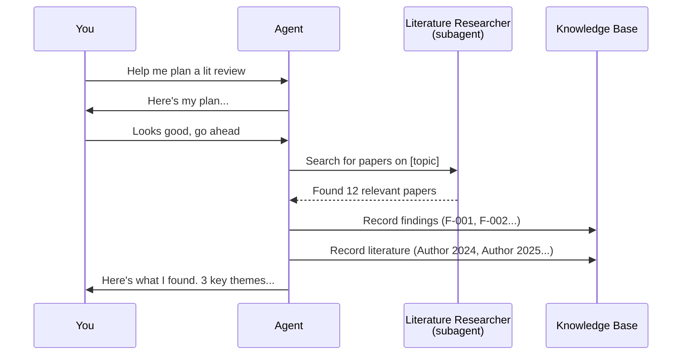

# Your First 30 Minutes

You've installed the tools, created your project, and filled in your project brief. Now let's start working.

## Starting a Session

Navigate to your project folder and type:

```bash
cd ~/Documents/research_projects/my_first_study
claude
```

### What Happens Immediately

The framework runs a series of automatic checks before you see the prompt. You'll notice some text appearing — this is normal. Here's what it means:

```
[SESSION START] project_brief.md found.
[SESSION START] research_state.md found. Read it and confirm your understanding.
[SESSION START] 0 fresh and 0 recent lessons found.
```

**Translation**: "I found your project brief, I see your state document, and there are no lessons from previous sessions yet (because this is your first one)."

The agent will then introduce itself and confirm what it knows about your project. It reads your `project_brief.md` and `research_state.md`, and says something like:

> "I see this is a new project on [your topic]. The state document shows we're in initial setup. Let me confirm my understanding..."

**Your response**: Read what it says and correct anything it got wrong. This is your chance to make sure you're both on the same page.

---

## The "Noted" Protocol

When you have a lot of context to share — background reading, ideas, requirements — use the **Async Input Protocol**:

1. Type your first piece of context
2. The agent responds with just: **"noted"**
3. Type your next piece of context
4. Agent: **"noted"**
5. Keep going until you've shared everything
6. Type: **"I am done."**
7. NOW the agent engages fully with everything you've shared

**Example:**

```
You: I've been reading about few-shot learning for mental health classification.
     The key paper is Sánchez Rodríguez et al. (2026).

Agent: noted

You: The dataset we'll use is ANGST from HuggingFace — 4 classes:
     Depression, Anxiety, Comorbid, Normal.

Agent: noted

You: Our baseline should be a single LLM pass without any feedback loop.
     I want to compare against a two-agent system.

Agent: noted

You: I am done.

Agent: [Now provides a full, thoughtful response addressing everything]
```

**Why this exists**: Without it, the agent would start planning after your first message and might go in the wrong direction before you've finished explaining.

---

## Your First Plan-Review-Execute Cycle

This is the core workflow. Let's walk through it with a concrete example.

### You Say:

> "I'd like to start with a literature review on multi-agent LLM systems for mental health detection. Help me plan this."

### Step 1: PLAN — The Agent Proposes

The agent doesn't immediately start searching. Instead, it presents a plan:

> **Plan: Literature Review on Multi-Agent LLM Mental Health Detection**
>
> 1. Search for recent papers (2024-2026) on LLM-based mental health detection
> 2. Focus on multi-agent and iterative feedback architectures
> 3. Record key findings in the knowledge base under `literature`
> 4. Identify gaps that motivate our approach
>
> I'll delegate the initial search to the literature-researcher agent.

### Step 2: CLARIFY — The Agent Asks ONE Question

> "Should I focus on social media data specifically, or include clinical text and EHR-based studies as well?"

Notice: **one question at a time**, never a list of five. This keeps the conversation manageable.

### Step 3: REVIEW — You Refine Together

> You: "Focus on social media. Also include papers on confidence calibration in LLMs — that's relevant to our feedback mechanism."

> Agent: "Good addition. Revised plan: [updated plan with calibration papers]. I should also note that the confidence calibration angle connects to potential failure modes in our system — worth flagging as an open question."

**This is where the agent earns its keep** — it doesn't just agree with you. It challenges assumptions, surfaces connections you might have missed, and suggests additions.

### Step 4: APPROVE — You Give the Green Light

> You: "Looks good. Go ahead."

Only these words (or similar explicit approval) trigger execution. The agent never acts on a plan without your say-so.

### Step 5: EXECUTE — The Agent Works

The agent delegates the search, reviews results, and records findings. You'll see it working — reading papers, creating knowledge base entries, updating the state document.



---

## What Those Hook Messages Mean

As you work, you'll occasionally see messages in brackets. These are the framework's automatic checks — think of them as a responsible lab assistant quietly keeping things organized:

| Message | What It Means | Do You Need to Do Anything? |
|---------|--------------|----------------------------|
| `[LESSONS CHECK] 3 recent lessons...` | "Before I act, let me check what we've learned from past sessions." | No. The agent handles this automatically. |
| `[KB PRIME] 42 active entries...` | "Here's what's in our knowledge base right now." | No. This just helps the agent find relevant context. |
| `[BREATH CHECK] 12m since last self-check...` | "It's been a while — let me verify I'm still on track." | No. The agent pauses to check itself and continues. |
| `[STATE REMINDER] research_state.md not updated...` | "I should update our state document." | No. The agent updates it. |

**You don't need to respond to any of these.** They're conversations between the framework and the agent. You'll only be involved if the agent discovers something that needs your input — like a finding that changes the direction of the project.

---

## Ending a Session

When you're done working, just type:

```
/exit
```

or press `Ctrl+C`.

Before the session ends, the framework automatically:
1. Checks if the state document is up to date
2. Rebuilds knowledge base indexes if anything changed
3. Saves everything to disk

**Everything persists.** When you start your next session (even days later), the agent reads your state document, knowledge base, and lessons — and picks up exactly where you left off.

---

## What Got Saved?

After your first session, your project folder has new content:

```
my_first_study/
  research_state.md          <-- Updated with what you worked on
  knowledge/
    decisions_active.md      <-- Any decisions made (e.g., "focus on social media data")
    literature_active.md     <-- Papers found during lit review
    findings_active.md       <-- Key findings recorded
    questions_active.md      <-- Open questions flagged
  lessons/
    lessons_index.md         <-- Any process insights from this session
  episodes/
    episode_2026-04-05_*.md  <-- Narrative summary of what happened
```

Next session, the agent reads all of this automatically. No re-explaining needed.

---

## Common First-Session Questions

**"The agent is proposing a plan I don't like."**
Say so! "I don't think that approach will work because..." The agent will revise. It's designed to be challenged.

**"The agent is asking too many questions."**
It should ask **one at a time**. If it bundles multiple questions, say: "One question at a time, please."

**"I don't understand what the agent is doing."**
Ask: "Can you explain what you're doing and why?" The agent will pause and explain.

**"I want to go back to something we discussed earlier."**
Say: "Let's revisit the decision about [topic]." The agent will look up the relevant knowledge base entry.

**"I made a mistake in my project brief."**
Just edit `project_brief.md` directly and tell the agent: "I've updated the project brief — re-read it."

---

## Next Steps

You've completed your first session! Head to:
- [03 Research Workflows](03_research_workflows.md) — Detailed guides for literature review, experiments, analysis, and writing
- [04 Invisible Helpers](04_what_happens_automatically.md) — Deeper understanding of what the framework does behind the scenes
