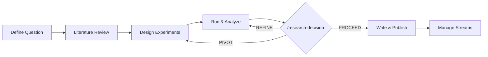
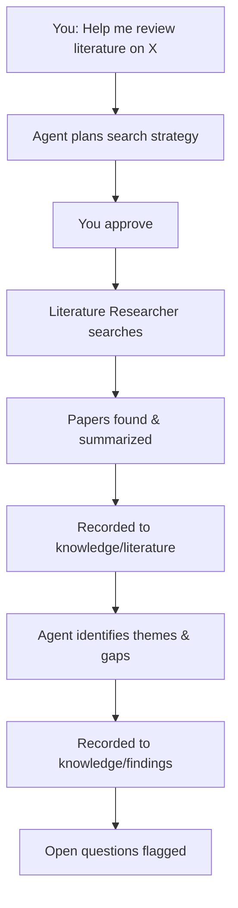
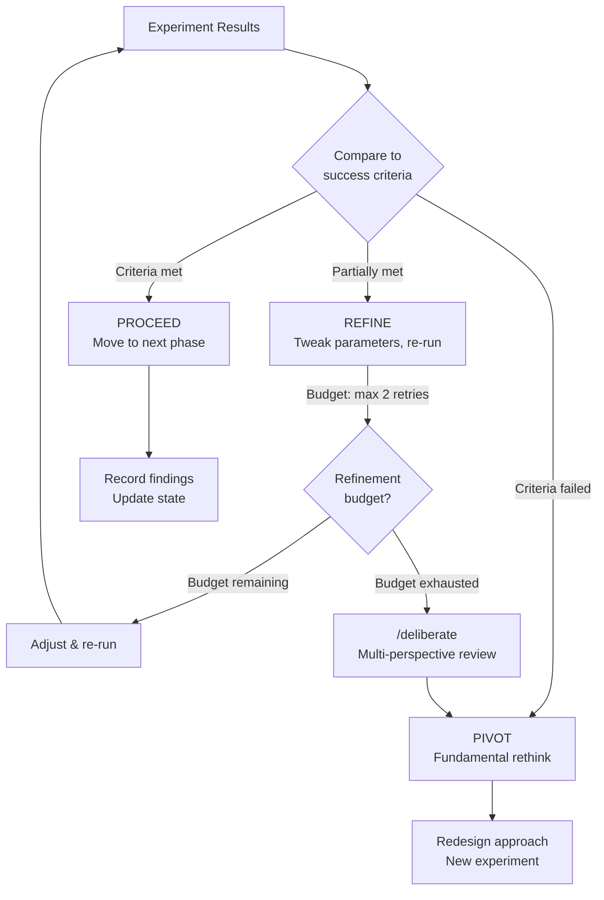
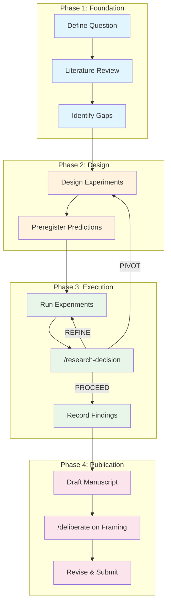

# Using the Framework for Research

This guide shows how to use the Research Collaborator for the activities that make up a typical research project. Each section includes example prompts you can adapt for your own work.



---

## 1. Starting a New Research Question

**When**: Beginning of a project, or when shifting to a new research direction.

**What to say:**

> "I want to investigate [your research question]. Here's what I know so far..."
> *(use the "noted" protocol if you have a lot of context)*
> "...I am done."

**What the agent does:**
1. Proposes a plan to formalize the research question
2. Helps you fill gaps in the project brief
3. Records initial decisions (D1, D2, ...) in the knowledge base
4. Sets up the research state document with scope boundaries

**What gets recorded:**

| Where | What |
|-------|------|
| `research_state.md` | Active phase, scope boundaries, initial assumptions |
| `knowledge/decisions_active.md` | D1: Research question formalization, D2: Initial methodology choice |
| `knowledge/questions_active.md` | Q-001: Open questions to investigate |

**Example exchange:**

```
You: I want to study how multi-agent LLM systems can detect mental health
     signals in social media posts. The key challenge is that single-pass
     classification misses nuanced cases.

Agent: [Proposes plan: 1) Define classification task, 2) Select dataset,
       3) Outline two-agent architecture, 4) Identify success metrics]

       Before we proceed — what mental health conditions are you targeting?
       Single diagnosis, or a multi-class task?

You: Multi-class: Depression, Anxiety, Comorbid, and Normal.

Agent: [Records D1: 4-class classification task. Continues planning...]
```

---

## 2. Literature Review

**When**: Establishing the theoretical foundation, finding related work, identifying gaps.

**What to say:**

> "Help me do a literature review on [topic]. I'm looking for [specific aspects]."

**What the agent does:**
1. Plans the search strategy (databases, keywords, time range)
2. Delegates search to the **literature-researcher** subagent
3. Reviews results and records each relevant paper
4. Identifies themes, gaps, and connections to your work

**Useful follow-ups:**

| Prompt | Purpose |
|--------|---------|
| "Focus on papers from the last 2 years" | Narrow the time range |
| "What do these papers say about [specific topic]?" | Synthesize across papers |
| "How does [Author 2024] relate to our approach?" | Compare with your method |
| "What gaps do you see in the literature?" | Identify your contribution |
| "Record this as a finding" | Explicitly save an insight |

**What gets recorded:**

```
knowledge/literature_active.md:
  - Sánchez Rodríguez et al. (2026): Reddit mental health classification...
  - Wang & Chen (2025): Multi-agent debate for clinical NLP...

knowledge/findings_active.md:
  - F-001: No existing work combines iterative feedback with multi-class detection

knowledge/questions_active.md:
  - Q-002: How does model size affect feedback loop effectiveness?
```



---

## 3. Experimental Design

**When**: Translating your research question into a concrete experimental setup.

**What to say:**

> "I want to design an experiment to test [hypothesis]. Here are my constraints: [time, compute, data]."

**What the agent does:**
1. Proposes an experimental design (variables, conditions, controls)
2. Challenges your assumptions ("What if [X] doesn't hold?")
3. Helps you preregister predictions
4. Records the experiment definition with success/failure criteria

**The framework's secret weapon — critical thinking:**

The agent is instructed to **challenge your assumptions**, not rubber-stamp them. Expect exchanges like:

```
You: Let's use 3 feedback rounds for the review agent.

Agent: Why 3 specifically? If the model converges after 1 round in most
       cases, rounds 2-3 add latency without benefit. I'd suggest we
       make this a parameter and test 1, 2, and 3 rounds in an ablation
       study.

       Also — have you considered that more rounds might actually hurt
       performance? If the review agent gives incorrect feedback, extra
       rounds amplify the error.
```

This is by design. The agent is a collaborator, not an assistant.

**What gets recorded:**

```
knowledge/experiments_active.md:
  EXP-001: Ablation study — feedback rounds (1 vs 2 vs 3)
  - Design: 3 conditions, 5 runs each, temperature=0.3
  - Prediction: Rounds 2-3 improve Comorbid class, no effect on Normal
  - Success criteria: Macro F1 improvement > 0.02 per additional round
  - Status: preregistered

knowledge/decisions_active.md:
  D5: Use temperature=0.3 for stochastic variation across runs
```

---

## 4. Running Experiments

**When**: Executing the experimental plan you've designed and approved.

**What to say:**

> "Let's run EXP-001. The script is at scripts/run_experiment.py."

**What the agent does:**
1. Reviews the experiment definition from the knowledge base
2. Runs the script (in the background if it takes >10 minutes)
3. Self-checks every 10 minutes during long runs (the **breath check**)
4. Records intermediate results as they come in
5. Reports final results

**Long-running experiments:**

For experiments that take more than 10 minutes, the agent runs them in the background and periodically checks in:

```
Agent: This experiment has 5 runs at ~3 minutes each (~15 minutes total).
       I'll run it in the background and monitor progress.

       [Starts experiment in background]

       ...

       [BREATH CHECK — 10 minutes later]
       Runs 1-2 complete. Intermediate results:
         Run 1: Macro F1 = 0.385
         Run 2: Macro F1 = 0.391
       Recording intermediate findings to knowledge base.
       Plan compliance: on track. No blockers detected.

       ...

       All 5 runs complete. Final results:
         Macro F1 = 0.388 (SD = 0.012)
       Shall I invoke /research-decision to evaluate these results?
```

---

## 5. Analyzing Results — The Research Decision

**When**: After an experiment completes or a significant milestone is reached.

The agent invokes `/research-decision` and evaluates your results against the preregistered criteria:



**What to say:**

> "Let's evaluate these results."

**The three outcomes:**

| Decision | Meaning | What Happens Next |
|----------|---------|-------------------|
| **PROCEED** | Results validate the approach | Agent records findings, moves to next phase |
| **REFINE** | Partially promising — needs tweaking | Agent proposes parameter changes, re-runs (with a budget limit) |
| **PIVOT** | Core assumptions invalidated | Agent recommends `/deliberate` for multi-perspective analysis before changing direction |

**Example REFINE:**

```
Agent: REFINE recommended. Macro F1 = 0.388 (target: 0.400). The
       confidence calibration is the bottleneck — 98% of predictions
       have confidence >= 0.80 regardless of correctness.

       Proposed refinement: Add confidence calibration examples to the
       prompt. Refinement budget: 2 more runs.

       Shall I proceed with the refinement?
```

---

## 6. Writing for Publication

**When**: Turning your findings into a manuscript.

**What to say:**

> "Let's start writing the paper. Target venue is [conference/journal]."

The agent switches to **Publication Mode** — a more formal, academic tone with attention to reproducibility and peer review standards.

**Useful prompts for different sections:**

| Section | Example Prompt |
|---------|---------------|
| Introduction | "Draft an introduction that motivates our two-agent approach. Use findings F-001 through F-005." |
| Related Work | "Summarize our literature review entries into a related work section. Organize by theme." |
| Method | "Describe our experimental setup. Include all decisions from D1-D15." |
| Results | "Present the results from EXP-001 through EXP-003. Include statistical tests." |
| Discussion | "What are the implications of our findings? What are the limitations?" |

**For high-stakes framing decisions — use `/deliberate`:**

When you need to decide on paper framing, contribution positioning, or how to handle negative results, invoke the deliberation protocol:

> "I'm not sure how to frame our paper. Let's /deliberate."

This spawns 4 simulated reviewers who analyze your options from different perspectives:
1. **Collaborator**: An adjacent-discipline researcher (reframes your contribution)
2. **Editor-in-Chief**: Publication viability and framing
3. **Reviewer 2**: Attacks weaknesses (better to hear this before submission)
4. **Strategist**: Integrates all perspectives into a recommendation

---

## 7. Managing Multiple Research Streams

**When**: You have parallel threads of investigation within a project.

As your project grows, you might be working on a main experiment while also developing a follow-up idea or exploring a tangent. Sub-projects keep these organized:

```
/sub-project create dark-side "Failure Modes Paper"
/sub-project create icl-pilot "Few-Shot Learning Enhancement"
/sub-project switch dark-side
```

Each sub-project gets its own:
- State document
- Knowledge base
- Lessons learned
- Episode summaries

**Capturing ideas without context-switching:**

If you're working on the main experiment and have an idea for a different stream:

> `/sub-project capture icl-pilot "Try 5 Normal-class examples as few-shot context"`

The idea gets recorded in the `icl-pilot` sub-project without disrupting your current work.

---

## Workflow Summary



Throughout all phases, the framework automatically:
- Records decisions, findings, and literature
- Maintains the state document
- Surfaces relevant past knowledge
- Self-checks during long tasks
- Captures lessons for future sessions
