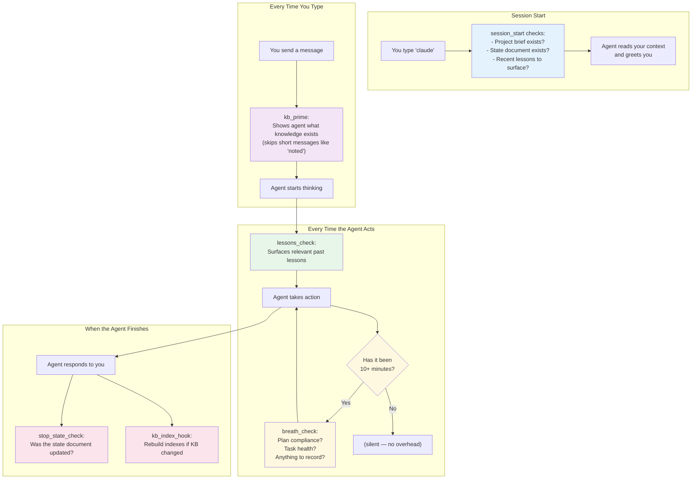
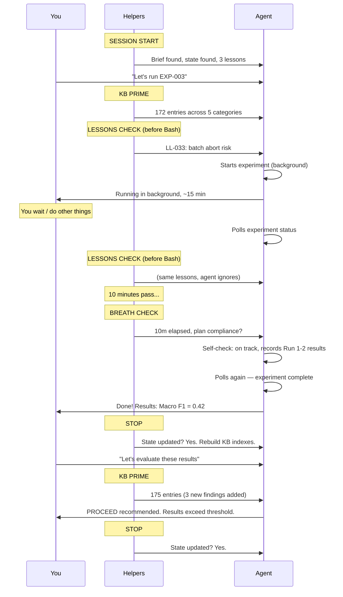

# The Invisible Helpers

The Research Collaborator has a set of automatic checks that run in the background. You don't need to trigger them or respond to them — they keep the AI on track so you can focus on your research.

Think of them as a responsible lab manager who quietly organizes the lab notebook, checks that experiments are following the protocol, and reminds the researcher to write things down.

## When Do They Fire?



---

## The Helpers, One by One

### Session Start — "Welcome Back"

**When**: The moment you start a new session.

**What it does**: Checks that your project brief and state document exist. Counts how many recent lessons are available. If you have a sub-project active, reports that too.

**What you see**:
```
[SESSION START] project_brief.md found.
[SESSION START] research_state.md found. Read it and confirm your understanding.
[SESSION START] 4 fresh and 2 recent lessons found.
```

**Why it matters**: The agent starts every session knowing exactly where you left off. No "Can you remind me what we were doing?" needed.

---

### KB Prime — "Here's What We Know"

**When**: Every time you send a message (except very short ones like "noted" or "yes").

**What it does**: Counts how many entries are in each category of your knowledge base and tells the agent where to find them.

**What you see**:
```
[KB PRIME] 172 active entries across 5 categories:
  Decisions: 56 | Experiments: 9 | Findings: 57 | Literature: 36 | Questions: 15
  Indexes -> knowledge/{decisions,experiments,findings,...}_index.md
  Read the relevant index before answering if this prompt involves
  past decisions, experiments, or findings.
```

**Why it matters**: As your project grows (50, 100, 200+ entries), the agent needs to be reminded that this knowledge exists. Without this nudge, it might answer from its general training instead of consulting your specific project history.

**What you don't see**: On short messages like "noted", "yes", or "proceed", this helper stays silent — no wasted effort.

---

### Lessons Check — "Remember What We Learned"

**When**: Before the agent takes any significant action (writing files, running commands, creating tasks).

**What it does**: Scans your lessons index for fresh insights from recent sessions and shows them to the agent.

**What you see**:
```
[LESSONS CHECK] Before proceeding with this action, consider 3 recent lesson(s):
| LL-033 | Batch abort amplification | tooling | 2026-04-04 | high | yes | fresh |
| LL-034 | RA v9 echo fragility | design | 2026-04-04 | high | yes | fresh |
```

**Why it matters**: Research involves learning from mistakes. If you discovered last week that a certain approach fails, this helper makes sure the agent remembers that before trying something similar. It's like a post-it note on the lab bench that says "DON'T use buffer X — it precipitates."

---

### Breath Check — "Are We Still on Track?"

**When**: Every 10 minutes during active work. Silent at all other times.

**What it does**: Nudges the agent to pause and verify:
1. Is the current work still aligned with the approved plan?
2. Are there any blockers or unexpected results?
3. Should any intermediate findings be recorded?
4. Does the state document need updating?

**What you see**:
```
[BREATH CHECK] 12m since last self-check. (research_state.md last updated 15m ago)
  1. Plan compliance — re-read research_state.md and verify current work
     matches the approved plan
  2. Task health — any blockers, errors, or unexpected results to flag?
  3. Record findings — capture any intermediate results to knowledge/
  4. Update state — if substantive progress occurred, update
     research_state.md now
```

**Why it matters**: During long experiments (30+ minutes), AI models gradually drift from the plan. This is the equivalent of setting a timer to step back and check your work. Without it, the agent might spend 20 minutes going down a path you didn't approve.

**You don't need to do anything**. The agent reads the nudge, self-corrects if needed, and continues working.

---

### State Check — "Did We Write This Down?"

**When**: After every agent response (except after "noted" responses).

**What it does**: Checks if the state document was updated recently. If it wasn't updated during a substantive exchange, it reminds the agent.

**What you see** (only when the state is stale):
```
[STATE REMINDER] research_state.md was not updated this turn.
If this was a substantive exchange, update the state document
before proceeding.
```

**Why it matters**: The state document is your project's source of truth. If the agent makes decisions or records findings but forgets to update the state document, the next session might start with outdated context.

---

### KB Index Maintenance — "Organizing the Filing Cabinet"

**When**: At the end of each session, if knowledge base files were modified.

**What it does**: Rebuilds the index tables (compact lookup tables for each KB category) and automatically moves entries marked as "superseded" or "resolved" to the archive.

**What you see**: Usually nothing — it runs silently. If entries were archived:
```
Auto-archived 2 entries (1 decision, 1 question). Indexes rebuilt.
```

**Why it matters**: Without this, your knowledge base would get cluttered with outdated entries. The automatic archival keeps your active files clean while preserving history in the archive.

---

### Lesson Watcher — "Did Something Teach Us Something?"

**When**: After every tool the agent runs (cheap — no AI call, just a few lines of bookkeeping). The actual "propose lessons" decision only fires every ~15 minutes, or sooner if multiple tool calls have errored.

**What it does**: Quietly writes a one-line record of each substantive tool call (failing Bash commands, file edits, subagent returns, rework loops) to a buffer file at the project root. When the buffer accumulates enough activity — or any errors appear — the helper emits a nudge telling the agent to invoke `/propose-lessons`, which dispatches a background subagent to draft candidate lessons.

**What you see** (only when the gate fires):
```
[LESSON EXTRACT] Buffer has 18 events (2 errors) over 16m.
  Invoke /propose-lessons to scan the buffer for candidate lessons.
  The skill launches a background Task subagent that writes candidates
  to .proposed_lessons.md for your review.
```

When the agent runs `/propose-lessons`, a few seconds later you'll see a one-line summary like:
```
/propose-lessons: 2 candidates written to .proposed_lessons.md
  - [LLC-20260409-1] uv run vs bare python drift on macOS
  - [LLC-20260409-2] Orchestrator edits breaking feedback pool contract
```

**Why it matters**: Before this helper, lessons were only captured at session end or when you explicitly asked for a reflection. Real moments of learning — a failing test that reveals a hidden assumption, a rework loop showing a brittle design, a subagent return that exposed a gap in your KB — used to vanish once the turn moved on. Now they land in a staging file you review when you're ready, and promote to the permanent lessons KB via `/lessons-learned` only if they're worth keeping.

**What you don't need to do**: The buffer is ignored on successful Read/Glob/TodoWrite calls (no signal). You don't have to clean up the buffer — it rotates automatically. You don't have to accept every candidate — many will be borderline or near-duplicates of existing lessons; discard them with a single text edit.

**Your review path**: Open `.proposed_lessons.md`, skim the candidates, delete the ones that aren't load-bearing, run `/lessons-learned` on the ones you want to keep. The skill's permanent-write behavior is unchanged — it's still the single writer to `lessons/*.md`.

---

### Note-Taker — "Capturing Your Ideas"

**When**: Every time you drop an idea during the "noted" async-input protocol.

**What it does**: After each "noted" response, the agent silently launches a background Haiku subagent that classifies your idea and writes it to the correct destination:

- **KB entries** (questions, decisions, findings, experiments, literature, reviews) are written directly to `knowledge/*_active.md` with `Status: captured`.
- **Lessons** (reasoning reflections, hindsight corrections) are staged to `.proposed_notes.md` for your review.
- **Uncertain items** (too vague to classify) are also staged for manual triage.

**What you see**: Nothing. The visible response is still just "noted". Classification and writing happen entirely in the background.

**What you don't see**: Each subagent uses `fcntl.flock()` file locking to handle the case where you drop multiple ideas in quick succession — no duplicate IDs, no corrupted files.

**After brainstorming**: Run `/note-taker status` to see what was captured, or `/note-taker review` to triage staged items. KB entries with `Status: captured` are indexed by the Stop hook automatically — they're searchable immediately but flagged as provisional until you upgrade them to `active`.

**Why it matters**: Before this helper, ideas dropped during the "noted" protocol lived only in conversation context. If the session was long, they could be lost to context compression. Now every substantive idea lands in a durable, categorized location from the moment you type it.

---

### Pre-Compact Backup — "Safety Net"

**When**: Before the system compresses old conversation messages (happens automatically when conversations get very long).

**What it does**: Creates a timestamped backup of your state document and injects guidance about which files to re-read after compression.

**What you see**:
```
[PRE-COMPACT] Backed up research_state.md to .state_backups/
After compaction, re-read these files to restore context:
  - research_state.md (authoritative state)
  - knowledge/*_index.md (quick lookup)
```

**Why it matters**: Very long sessions (100+ exchanges) may trigger automatic context compression. This backup ensures no state is lost, and the agent knows how to recover its context.

---

## The Full Picture

Here's what a typical 45-minute session looks like from the helpers' perspective:



### PM Backlog — "Tracking Your Requests"

**When**: Every time you send a message (via KB Prime) and at session start.

**What it does**: Counts open, in-progress, and blocked tickets in `.pm_backlog.md` and shows the summary.

**What you see**:
```
[PM] Tickets: 3 open, 1 in-progress, 0 blocked -> .pm_backlog.md
```

**Why it matters**: When you drop ideas during the "noted" protocol, each question is automatically captured as a PM ticket. The agent sees the ticket count on every prompt and will ask you whether to prioritize existing tickets or proceed with new work when you start a new task. Use `/pm list` to see the full backlog.

**Automatic ticket lifecycle**: Questions captured during "noted" sessions → auto-registered as tickets → agent works on them when you approve → `/research-decision` auto-closes resolved tickets.

---

## Key Takeaway

You don't need to manage any of this. The helpers work silently, and the agent responds to their nudges automatically. Your job is to:
- **Direct the research** (what to investigate, which experiments to run)
- **Make decisions** (approve plans, evaluate results)
- **Provide expertise** (domain knowledge the AI doesn't have)

Everything else — note-taking, self-checking, knowledge organization — is handled for you.
